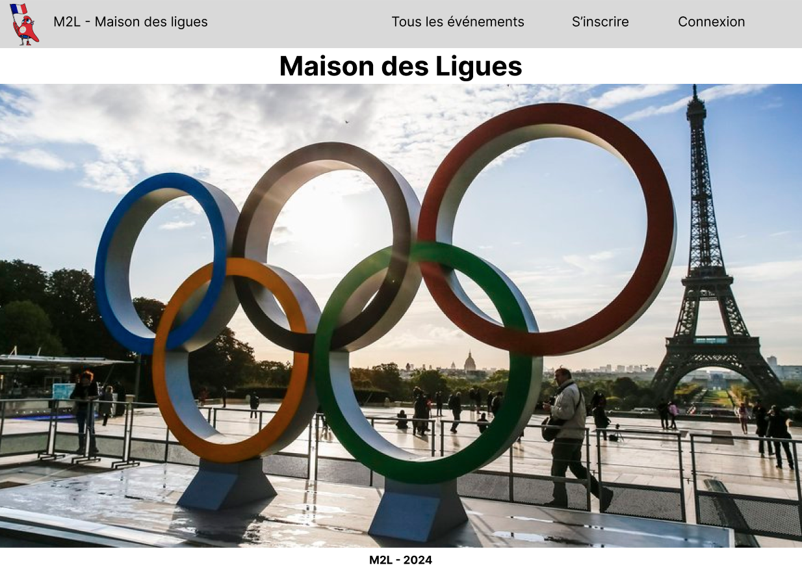
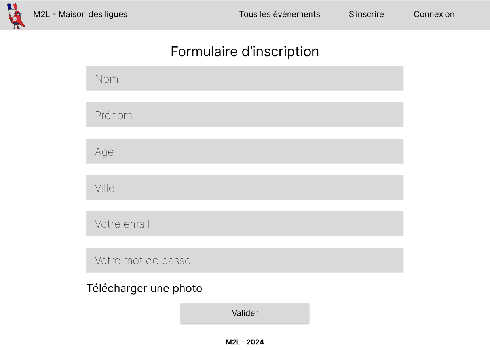

# Maison des ligues

## Contexte du projet

Dans le cadre de notre BTS, nous devons réaliser un projet web, une connexion à une base de donnée et une gestion d'employés et d'événements.
Cette situation professionnelle est réalisée dans le contexte de la M2L ou Maison des ligues de Lorraine.
Nous devons développer une page publicitaire pour la Maison des Ligues. A l’occasion des Jeux de Paris 2024, cette promotion a pour but de conquérir des nouveaux abonné(e)s, en proposant la diffusion de toutes les compétitions sportives.

Un cahier des charges nous a été imposé ainsi qu'un wireframe et une charte graphique. La maquette devait être réaliser par nous-même.

## Wireframe
insérer le wireframe

## Maquette

#### Page d'accueil

#### Ajout d'un événement

#### Formulaire d'inscription

#### Confirmation de connexion

#### Connexion administrateur

#### Administration des membres
