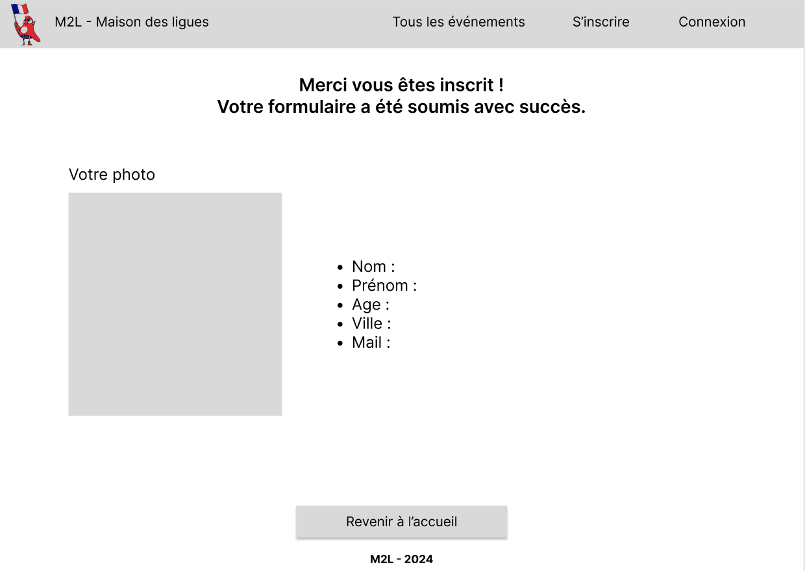

# Maison des ligues

## Contexte du projet

Dans le cadre de notre BTS, nous devons réaliser un projet web, une connexion à une base de donnée et une gestion d'employés et d'événements.
Cette situation professionnelle est réalisée dans le contexte de la M2L ou Maison des ligues de Lorraine.
Nous devons développer une page publicitaire pour la Maison des Ligues. A l’occasion des Jeux de Paris 2024, cette promotion a pour but de conquérir des nouveaux abonné(e)s, en proposant la diffusion de toutes les compétitions sportives.

Un cahier des charges nous a été imposé ainsi qu'un wireframe et une charte graphique. La maquette devait être réaliser par nous-même.

Les technologies autorisées sont le HTML/CSS, JS et PHP.

## Wireframe
Ci-dessous le wireframe sur lequel nous devions nous baser pour la conception de notre site web.

## Maquette

Ci-dessous la maquette que nous devions concevoir nous même en nous référent au wireframe imposé.

#### Page d'accueil

#### Les événements crées

Visible par tous, il n'est pas nécessaire d'avoir un compte afin d'accèder aux informations des événements.

#### Formulaire d'inscription

#### Confirmation d'inscription

#### Connexion

A partir de cette fenêtre il est possible de se connecter à son compte afin d'ajouter un événement. Si l'utilisateur est un adminstrateur il aura également les droits de modifications et de suppression sur tous les utilisateurs.

#### Ajout d'un événement

L'ajout d'événements nécéssite d'avoir crée un compte au préalable.

#### Administration des membres

Accesible seulement pour les administateurs du site.

